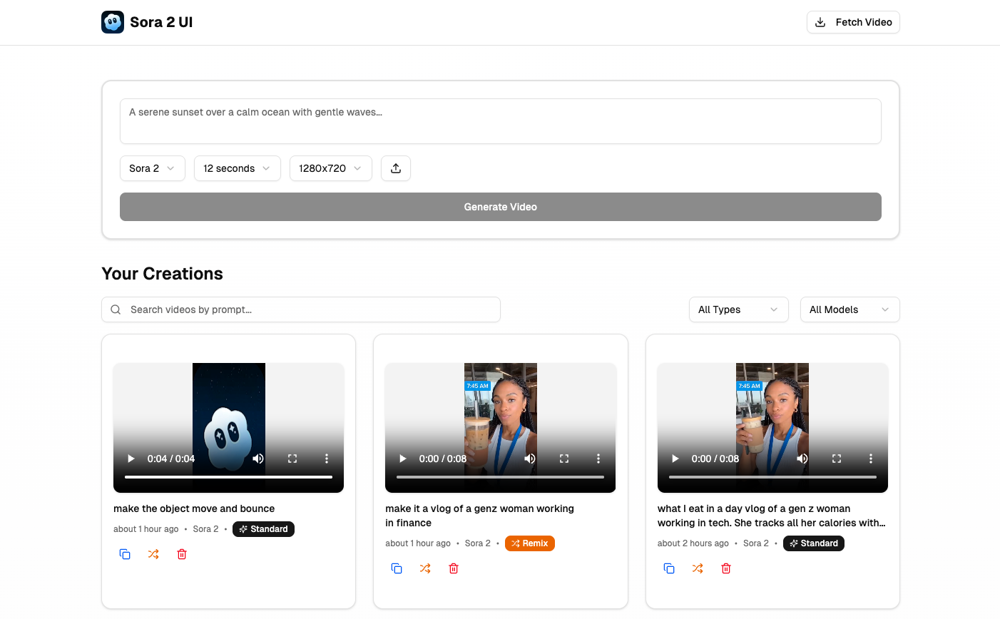

# Sora 2 UI



A simple and complete UI to use Sora 2 & Sora 2 PRO video models to generate videos. 
It supports:
- Input Reference (Video or Image)
- Video Remix

## Prerequisites

Before you begin, ensure you have the following installed:

- [Node.js](https://nodejs.org/) (version 18 or higher)
- [pnpm](https://pnpm.io/) (recommended package manager)
- A [Supabase](https://supabase.com/) account and project
- A [OpenAI Developer Account](https://platform.openai.com/) and an API key

## Getting Started

### 1. Clone the repository

```bash
git clone <your-repo-url>
cd sora-2-ui
```

### 2. Install dependencies

```bash
pnpm install
```

### 3. Set up environment variables

Create a `.env.local` file in the root directory and add your Supabase credentials:

```bash
NEXT_PUBLIC_SUPABASE_URL=your_supabase_project_url
NEXT_PUBLIC_SUPABASE_ANON_KEY=your_supabase_anon_key
```

You can find these values in your Supabase project dashboard under Settings > API.

### 4. Set up Supabase (Database + Storage)

**Quick Setup (Recommended):**

Run the complete setup script in your Supabase SQL editor:

```bash
scripts/000_complete_setup.sql
```

This single script sets up:
- ✅ Videos table with proper schema
- ✅ All indexes for fast queries (10+)
- ✅ Storage policies for secure access (4)
- ✅ Database functions and triggers (3)

**Create Storage Bucket (30 seconds)**

⚠️ **Important:** Storage buckets must be created manually

1. Go to **Storage** (left sidebar)
2. Click **"New Bucket"**
3. Name: `videos`
4. Public bucket: ✅ **YES** (check this!)
5. Click **"Create bucket"**


### 5. Run the development server

```bash
pnpm dev
```

Open [http://localhost:3000](http://localhost:3000) in your browser to see the application.


## Available Scripts

- `pnpm dev` - Start the development server
- `pnpm build` - Build the application for production
- `pnpm start` - Start the production server
- `pnpm lint` - Run ESLint

## Environment Variables

The following environment variables are supported:

| Variable | Description | Required | Default |
|----------|-------------|----------|---------|
| `NEXT_PUBLIC_SUPABASE_URL` | Your Supabase project URL | Yes | - |
| `NEXT_PUBLIC_SUPABASE_ANON_KEY` | Your Supabase anonymous key | Yes | - |
| `OPENAI_API_KEY` | Your OpenAI API key | Yes | - |
| `NEXT_PUBLIC_AUTH_ENABLED` | Enable/disable authentication requirement | No | `true` |

### Authentication Configuration

The application supports optional authentication using Supabase:

- **When `NEXT_PUBLIC_AUTH_ENABLED=true`** (default): Users must authenticate before accessing the application
- **When `NEXT_PUBLIC_AUTH_ENABLED=false`**: Authentication is bypassed and users can access the application directly

To set up authentication in Supabase:
1. Go to your Supabase project dashboard
2. Navigate to Authentication > Settings
3. Configure your authentication providers (email/password, OAuth, etc.)
4. Update your `.env.local` file with the NEXT_PUBLIC_AUTH_ENABLED setting

## Database Schema

The application uses the following main table:

### Videos Table
- `id` (UUID) - Primary key
- `prompt` (TEXT) - The text prompt used to generate the video
- `video_url` (TEXT) - URL of the generated video
- `created_at` (TIMESTAMP) - Creation timestamp
- `status` (TEXT) - Current status of the creation
- `error_message`(TEXT) - Any error message returned by the API endpoint
- `creation_type` (TEXT) - standard creation or existing content remix

## Contributing

1. Fork the repository
2. Create a feature branch (`git checkout -b feature/amazing-feature`)
3. Commit your changes (`git commit -m 'Add some amazing feature'`)
4. Push to the branch (`git push origin feature/amazing-feature`)
5. Open a Pull Request

## Deployment

This application can be deployed on any platform that supports Next.js:

### Vercel (Recommended)
1. Connect your repository to Vercel
2. Add your environment variables in the Vercel dashboard
3. Deploy automatically on every push to main

Make sure to set the environment variables in your deployment platform.

## Authot

- Stefano Cantù ([@madeinusmate](http://x.com/madeinusmate))

## License

This project is licensed under the MIT License - see the [LICENSE](LICENSE) file for details.

## Support

If you encounter any issues or have questions, please open an issue on GitHub.